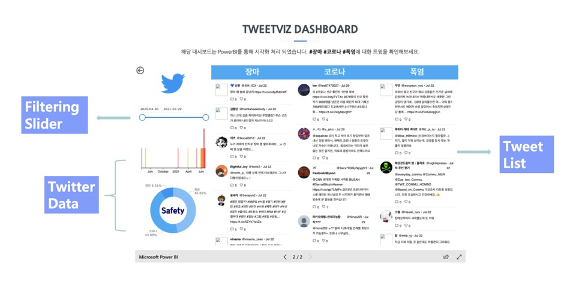

# Boaz_tweetviz
- 지하철 지연 등 안전 사고 관련된 뉴스는 실시간 트위터보다 뉴스가 늦게 나온다는 문제 존재. 안전 사고 관련 tweet들을 실시간으로 보여주는 대시보드 개발
- 실시간 데이터 파이프라인 구축 twitter api, Kafka, MongoDB Sink Connector 활용
- 클라우드 버전으로 GCP Cloud PubSub, DataFlow, BigQuery 활용 파이프라인 구축
- PowerBI를 통한 대시보드 구축
- [소개링크](https://boaz-tweetviz.github.io/)

